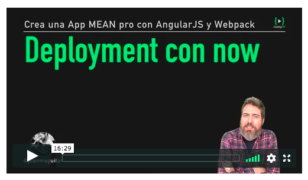

# 12- Deployment con `now`

En esta lección vamos a hacer el _deployment_ (subir a producción) nuestro proyecto, tanto la parte de cliente como la de servidor realizando antes algunos ajustes para que nuestra app maneje URL's diferentes según el entorno en el que esté



## Preparando nuestra app para que maneje url's diferentes en desarrollo y en producción

A través de webpack podemos "inyectar" variables en nuestra app que tengan valores diferentes según diferentes entornos

Para ello creamos primero un `config.json` con los posibles valores de `API_URL`

**`config.js`**
```
{
  "API_URL": {
    "production": "https://server-proxy-api-unsplash-hyyqdbqqtv.now.sh",
    "development": "http://localhost:3000"
  }
}
```

Y en nuestro `webpack.config.js` cargamos este `config.js` para asignarle a `API_URL` el valor adecuado según el valor de una variable de entorno `NODE_ENV`

A través del plugin [`DefinePlugin`](https://webpack.js.org/plugins/uglifyjs-webpack-plugin/) podemos dejar disponible esta variable `API_URL` en nuestra app

**`webpack.config.js`** 

```
const config = require('./config.json')
const environment = process.env.NODE_ENV === 'production' ? 'production' : 'development';

....

new webpack.DefinePlugin({
  API_URL: JSON.stringify(config.API_URL[environment])
})
```

En nuestro `package.json` modificamos el script `build` para que utilize `NODE_ENV=production` y así asignarle a `API_URL` el valor correspondiente a `production`

**`package.json`** 

```
"build": "rimraf dist && NODE_ENV=production webpack --progress",
```

En nuestro servicio podemos utilizar ya directamente `API_URL`

**`services/DataService.js`**
```
...
getPhotos () {
  this.$http
    .get(API_URL + '/search/' + this.query)
    .then(response => response.data.results)
    .then(photos => {
      this.photos = photos
    })
}
```

## Comprimiendo (reduciendo tamaño) el _bundle_ generado por webpack

Para comprimir el archivo aplicamos el plugin [`uglifyjs-webpack-plugin`](https://webpack.js.org/plugins/uglifyjs-webpack-plugin/)

```
const UglifyJsPlugin = require('uglifyjs-webpack-plugin')

new UglifyJsPlugin({ uglifyOptions: 
  { mangle: false }
})
```

## Subiendo el cliente a produccion

Para subir a produccion el cliente, generamos el _bundle_ final con `npm run build`, nos vamos a la carpeta `dist` y una vez dentro hacemos...

````
now --static
````

Esto subirá nuestro código a los servidores de now, lanzará un servidor de archivos estáticos y nos devolverá la URL a partir de la cual podremos acceder a nuestra app subida

## Resources

- https://zeit.co/now (frontend & backend deployments) [[1]](https://github.com/zeit/now-cli/issues/677)
- https://www.heroku.com/ (mayormente backend deployments)
- http://surge.sh/ (mayormente frontend deployments)
- [uglify manging problem in angular](https://stackoverflow.com/questions/17238759/angular-module-minification-bug#17239358)

